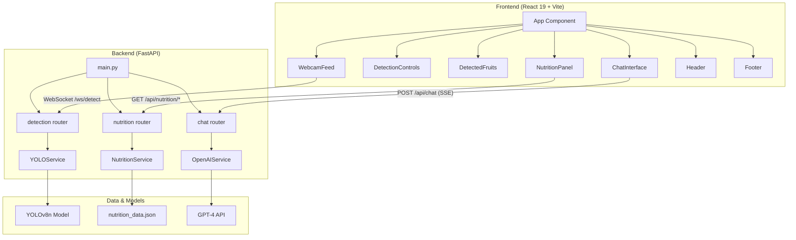
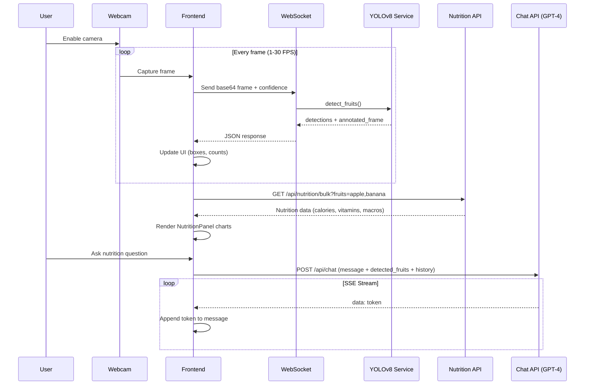
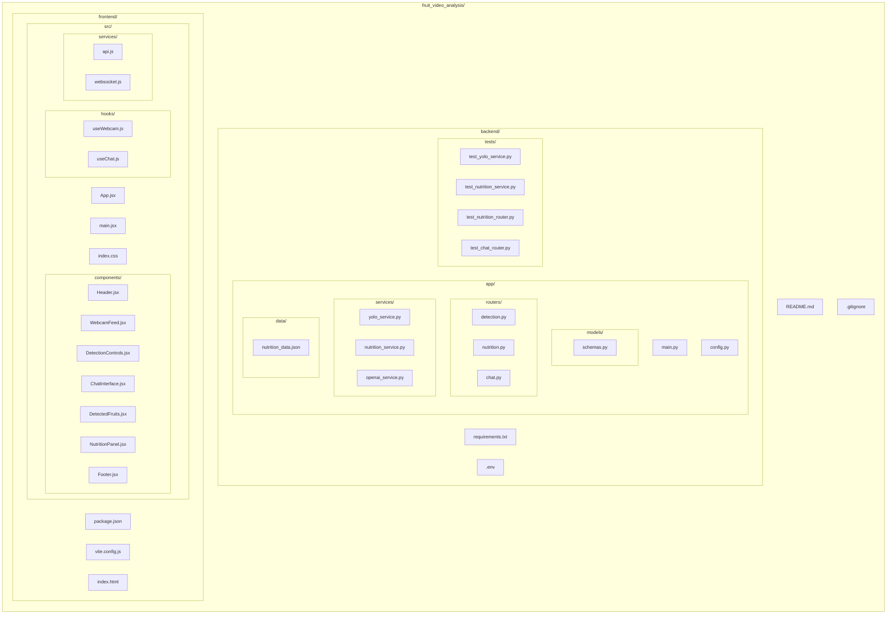
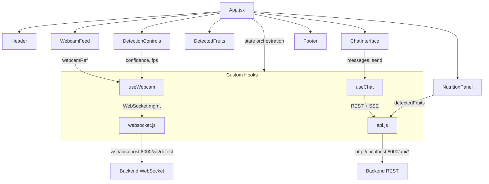
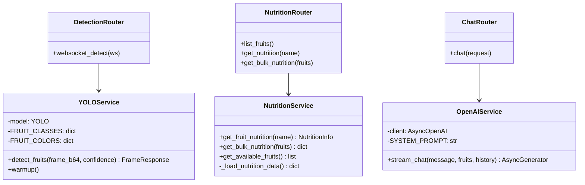

# Fruit Detection & Nutrition Analyzer

Real-time fruit detection system using computer vision (YOLOv8) with nutritional analysis and AI-powered nutrition guidance (GPT-4).

## Architecture Overview



## Data Flow



## Project Structure



## Tech Stack

| Layer | Technology | Purpose |
|-------|-----------|---------|
| **Frontend** | React 19 | UI framework |
| **Build** | Vite 7 | Dev server & bundler |
| **Styling** | Tailwind CSS 4 | Utility-first CSS |
| **Charts** | Recharts | Nutrition data visualization |
| **Backend** | FastAPI | Async Python API server |
| **Detection** | YOLOv8n (Ultralytics) | Real-time object detection |
| **Vision** | OpenCV | Image processing |
| **AI Chat** | OpenAI GPT-4 | Nutrition guidance |
| **Realtime** | WebSocket | Frame streaming |
| **Streaming** | SSE | Chat token streaming |
| **Validation** | Pydantic | Request/response schemas |
| **Testing** | pytest + pytest-asyncio | Backend tests |

## Features

- **Real-time fruit detection** via webcam with YOLOv8 (apple, banana, orange)
- **Adjustable confidence threshold** (0.1 - 1.0) and **FPS control** (1 - 30)
- **Annotated video feed** with colored bounding boxes per fruit type
- **Nutrition database** with 40+ fruits including macros and micronutrients
- **Interactive charts** showing calorie breakdown and vitamin percentages
- **AI nutritionist chat** with GPT-4 streaming responses aware of detected fruits
- **Auto-reconnecting WebSocket** with exponential backoff
- **Dark mode UI** with responsive design

## API Endpoints

| Method | Endpoint | Description |
|--------|----------|-------------|
| `GET` | `/health` | Health check |
| `WS` | `/ws/detect` | Real-time fruit detection |
| `GET` | `/api/nutrition/list` | List all available fruits |
| `GET` | `/api/nutrition/{name}` | Get nutrition for a fruit |
| `GET` | `/api/nutrition/bulk?fruits=...` | Batch nutrition lookup |
| `POST` | `/api/chat` | AI nutritionist chat (SSE stream) |

## Getting Started

### Prerequisites

- Python 3.10+
- Node.js 18+
- OpenAI API key

### Backend Setup

```bash
cd backend
python -m venv venv
venv\Scripts\activate        # Windows
# source venv/bin/activate   # macOS/Linux
pip install -r requirements.txt
```

Create a `.env` file:

```env
OPENAI_API_KEY=your-api-key-here
YOLO_MODEL=yolov8n.pt
YOLO_CONFIDENCE_THRESHOLD=0.5
CORS_ORIGINS=http://localhost:5173
```

Start the backend:

```bash
uvicorn app.main:app --reload --host 0.0.0.0 --port 8000
```

### Frontend Setup

```bash
cd frontend
npm install
npm run dev
```

The app will be available at `http://localhost:5173`.

### Running Tests

```bash
cd backend
pytest tests/ -v
```

## Detected Fruit Classes

| Class ID | Fruit | Box Color |
|----------|-------|-----------|
| 46 | Banana | Cyan |
| 47 | Apple | Green |
| 49 | Orange | Orange |

## Component Diagram



## Backend Services



## License

This project is for educational and demonstration purposes.
